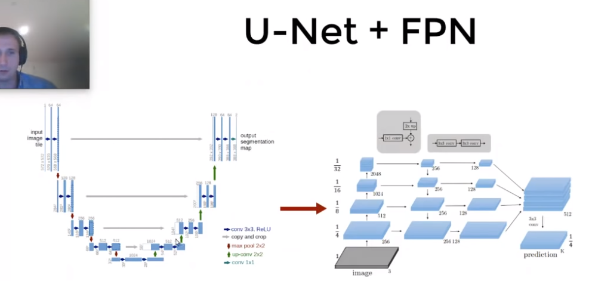
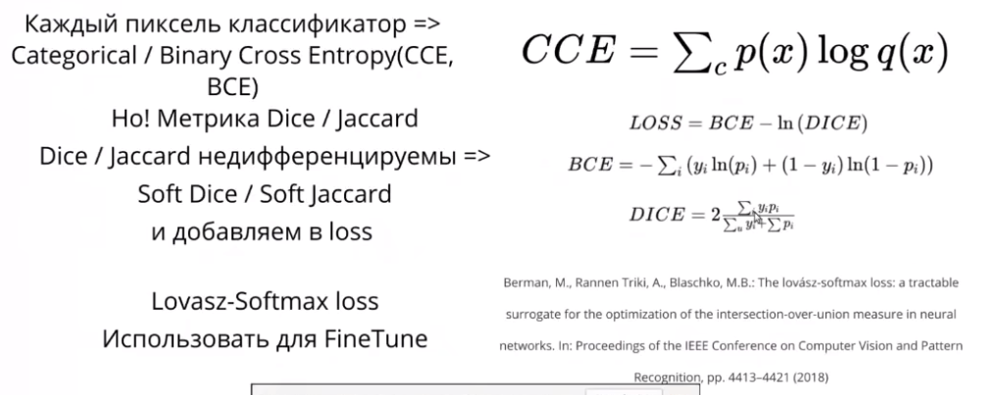
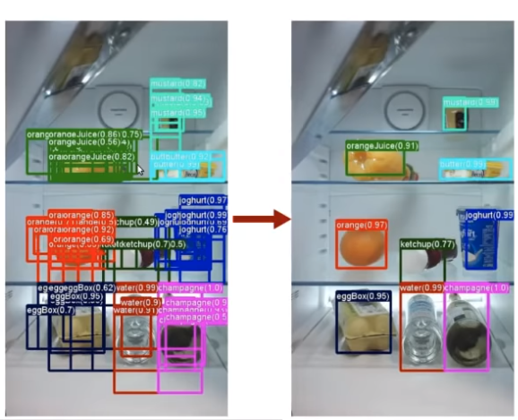
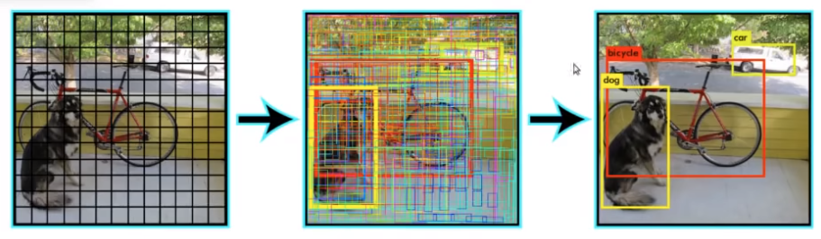

# Segmentation и Object Detection([Слайды](https://slides.com/vladimiriglovikov/title-texttitle-text-17))

**Сегментация(Segmentation)** = попиксельная классификация
* Не требует большого объёма тренеровочных данных
* Все сегметационные сети - это архитектуры вида FCN.

## Метрики
**Dice Coefficient**

**Cosine Coefficient**

**Jaccard Coefficient**

**X** - GT, **Y** - Predicton

**Fully Convolution Network(FCN)** - сесть без Dense слоёв(Fully connected слоёв)

Благодаря этому в сети оказывается мало параметров?

И берёт на вход картинки любого размера

**FCN** = Efficient Sliding Windows

# Classification to Segmentation
1. Оторвать Dense или Dense => Conv
2. Добавить декодер

**Upsampling** - повышение расширение изображения

**UNet** - отлчино работает из коробки

Нынче принто использовать UNet с левой частью(backbone) пре-натренерованной на ImageNet сетью

**Encoder(backbone)** - левая часть, берущая картинку, понижающее расширение, но увеличивающая количество каналов

**Decoder** - расширает картинку до исходного размера

Любая задача бинароной классификации изображений решается с помощью UNet!

## Feature Pyramid Networks(FPN)

1. Легко добавить во многие архитектуры
2. Помогает с multiscale

Для решения проблем с масштабом применялись аугументации с увеличенимем/уменьшением изображения, но это не решает все проблемы

FPN значительно лучше решает проблему различий масштаба

## Segmentation Loss Function

Какой то сложный слайд, надо обдумать

## Detection
Предсказываем:
1. Координаты боксов
2. Класс 
3. Опционально отрибуты

## Detection Metric: mAP

Очень замороченная метрика

Нужно свести в одно число точность бокса и confidence класса

Для каждого класса:
* Хотим получить Precision Recall Curve
* Цикл по трешхолдам confidence
* Трешхолд по IOU => TP, FP, FN
* mAP = area under PR Curve

**Non Maximum Supression(NMS)**

Detection = Предсказываем много боксов, потом фильтруем

## Detection

* One-shot(быстрые): YOLO, SSD, RetinaNet, SqueezeNet, DtectNet
* Two-shot(точные): R-FCN, Fast RCNN, Faster-RCNN

### One shot detectors

Для каждой ячейки в последнем conv слое предсказываем координаты бокса и класс объекта с цетром в ячейке.

### YOLO(you only look once)

### ONE shot detector with FPN = SSD

### Two shot

Мы выделаем объекты, а потом классифицируем каждый из них

Что там за сети как-то сложно((((