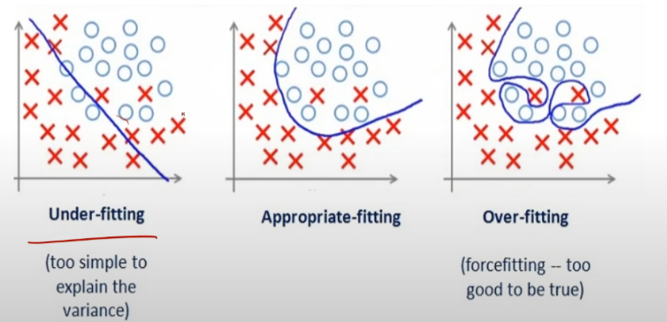
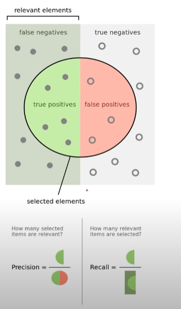
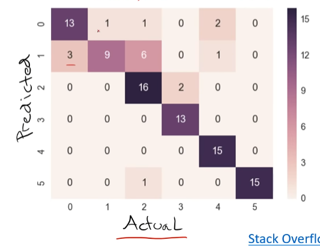

# Элементы машинного обучения([Слайды](https://www.dropbox.com/s/h1r9iju8i1c1gyp/Lecture%202%20-%20Machine%20Learning%20-%20annotated.pptx?dl=0))

Supervised Learning - обучение с учителем

Хорошая модель должна не просто хорошо приблежать тренировочные данные, а предсказывать тестовые

## Метод ближайших соседей

Train: просто запомнить

Predict: найти ближайший и выдать его класс

Метрики расстояний:

^2}}>)

Имеет 100% точность на тренеровочных данных

## Метод k-ближайших соседей (K-nearest neighbors, K-NN)

Как предыдущий, но выбираются k соседий и предсказание определяется по большенству

Гиперпараметры(hyper parameter) - параметр который выбирается вне процесса тренировки и не меняется в процессе тренеровки

## Переобучение и недообучение (Overfitting vs Underfitting)

Очень сложно вывести баланс

Как выбрать K для K-NN(и гиперпараметры вообще):

- Выбрать k=1 для 100% точности для train(плохо, переобучение под train)
- Выбрать лучший k для test(плохо, переобучение под test)
- Разбить данные на 3 датасета (train, val(валидационный), test), выбрать лучший k для val, а оценивать по train
- Кросс-валидация(Cross-validation): Разбить выборку на N частей и натренеровать модель N раз(каждый раз выбирая разную часть как тест), усреднить точность, подбирать оптимальную K

test часто называют holdout

## Стандартные метрики качества

### Бинарная классификация

**Точность**:

Проблемы:

- плохо работает при несбалансированных классах
- не учитывает стоимость ошибки

**Precision**:

**Recall**:

**F-score**:
}{precision%2Brecall}>)

### Многоклассовая колассификация

**Точность**:

Confusion matrix:

По сути чтобы посчитать Precission надо поделить значение клетки confusion matrix на сумму значений в строке, а для Recall в столбце

Так же можно посчитать 

Все эти метрики надо максимизировать

## Machine Learning Flow

### Разбить данные на train, val и test

Проверить ошибку на train, если она большая то нужно(underfitting):

- Взять более мощнеую модель
- Взять боьше ресурсов для тренеровки
- Использовать другой подход

Проверить ошибку на val, если она большая(overfitting):

- Взять больше данных
- Взять больше регуляризации
- Использовать другой подход

Проверить ошибку на test, если она большая:

- Отличаются train и test
- Взять больше данных, таких как test
