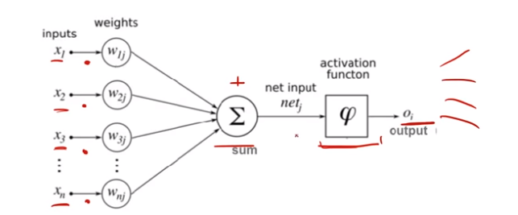
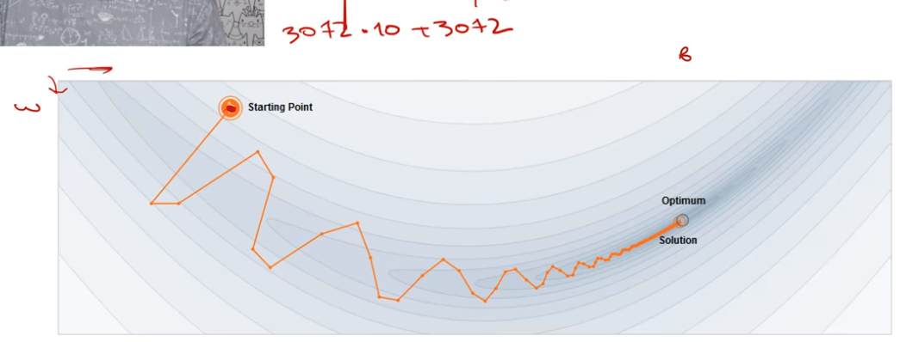
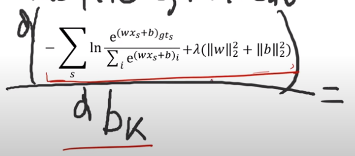
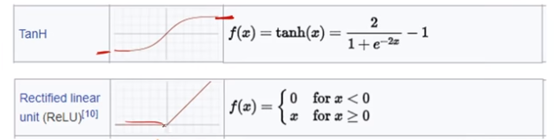
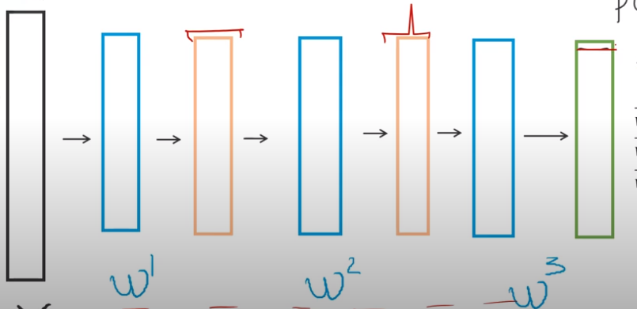
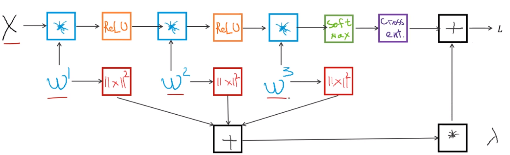
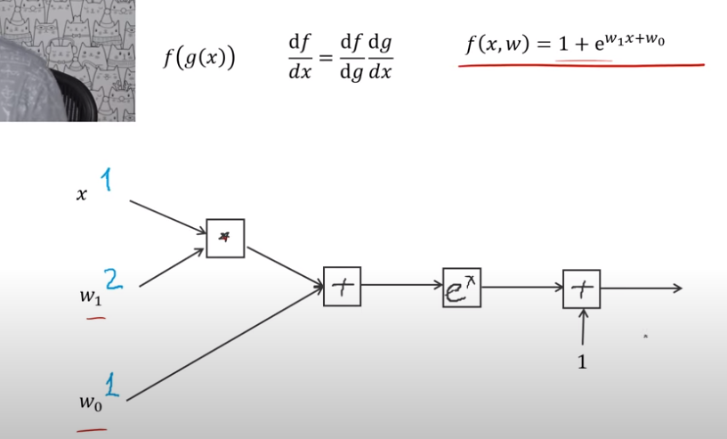
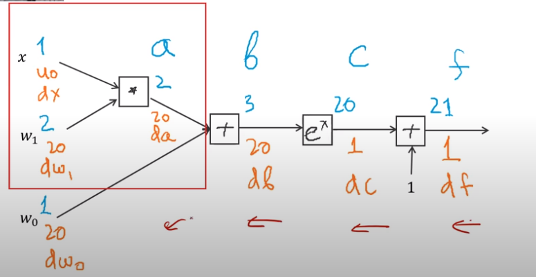
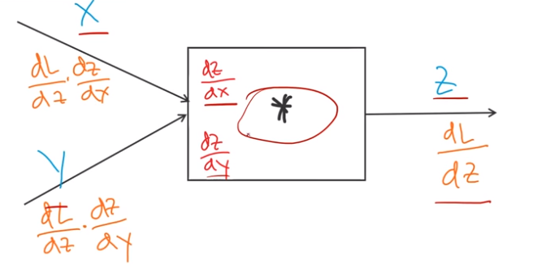

# Нейронные сети([Слайды](https://www.dropbox.com/s/ywn9xoxeyy7250b/Lecture%203%20-%20Neural%20Networks%20-%20annotated.pdf?dl=0))

Нейросети имают весьма условное отдношение к настоящим нейронам, они лишь вдохновлены ими



Как собрать нейросеть которая вычисляет число на кртинке:

1. Развернуть матрицу пикселей картинки в плоский вектор(32*32*3)
2. Подключть её к 10 нейронов и подобрать веса для связей

Если так сделать получится система равноценная **Линейному классификатору**

## Линейный классификатор


b - смещения(это аналог константых весов w0)

## Градиентный спуск



1. Выбираем случайную току
2. Находим градиент в этой точке
3. Делаем шаг в направление анти-градиента
4. Повторять шаги 2, 3, пока не сойдмся в точку, которая является локальным минимумом

?Для простых случаев даже есть гарантия схода в глобальный минимум(ковекс)?

Размер шага -  (гиперпараметр)

Чем меньше размерность тем выше вероятность глобальности минимума

## Softmax

Мы хотим чтобы в результате для каждого класса было число 0..1, это его вероятность. Сумма вероятностей должна быть = 1

=\frac{e^{y_0}}{e^{y_0}%2Be^{y_1}%2B...%2Be^{y_n}}=\frac{e^{y_0}}{\sum_{i}^{n}{e^{y_i}}}>)

Где C = 0 - значит что это вероятность 0-ого класса

Softmax - прямое расширение логиситческой функции для многоклассовой классификации

Это не единственный варант, но самый общепринятый

## Принцип максимального правдаподобия

1. Для каждого примера посчитать вероятность правильного ответа
2. Умножим все эти вероятности между собой

gt - ground truth(правильная метка)

=\prod_{s}{p(c=gt_s|x_s)}>)

Нам надо максимизировать эту метрику по w и b

Обычно приминяетя аналогичный метод который проще считать(Negative Log-likelihood):

=-\sum{ln{p}(c=gt_s|x_s)}>)

gt_s}}{\sum_{i}{e^{(wx_s+b)_i}}}}}=L>) - это loss

Эту страхомань мы и хотим минимизировать

## Регуляризация

gt_s}}{\sum_{i}{e^{(wx_s+b)_i}}}}}%2B\lambda+R(w,b)>)

L2 регуляризатор:
=||w||^2_2%2B||b||^2_2>)

Ругуляризатор позволяет сделать функцию более плавной и уменьшить вероятность overfit

 - гиперпараметр


## Снова градиентый спуск


 - размер шага(learning rate)

Как посчитать градиент?

**Finite differences(численный градиент)**

=\frac{L(x%2B\epsilon)-L(x-\epsilon)}{2\epsilon}>)

Рабочий, но не эффективный вариант, зато лекгко реализуется

**Analytic gradient(аналитический градиент)**



## Стохастический(случайный) градиентный спуск

}>)

Берём minibatch(часть примеров) и оптимизируем для неё

## Нейронные сети

Просто берём и добавляем больше одного слоя линейных классификаторов!

А нет, не просто, между слоями надо добавить функции активации(non-linear function)



ReLU круче TanH

На выходе у нас получается та же функция



%2B\lambda%20R(w)}>)


**Как посчитать**  ?

Колличество и параметры слоёв - гиперпараметры

## Граф вычислений

%2B\lambda%20R(w)}>)



Нам нужно найти численные градиенты по всем входам графа

Так умеет алгоритм back prpagation(обратного распространения ошибки)

## Back propagation(обратное распрострнаение ошибки)



Наш граф это большая очень сложная(вложенная) функция



Очень интересно, ничего не понятно(ну почти), [пресмотреть](https://youtu.be/kWTC1NvL894?t=4331)

## Общая схема вычисления градиента



## В коде

**forward**

```python
x = 1
w1 = 2
w0 = 1
a = x*w1
b = a + w0
c = np.exp(b)
f = 1 + c
```

**backward**

```python
df = 1
dc = df
db = np.exp(b)*dc
dw0 = db
da = db
dw1 = x*da
dx = w1*da
```

## Уточнения

Нода Max - зная где был максимум отдаёт градиент ему, а дргуим входам 0, если одинкаовые можно выбрать кому отдават случайно или делить попалам и отдать обоим

Если параметр участвует в вычислениях >1 раза и ему возвращают градиент разные ноды, их просто надо сложить
