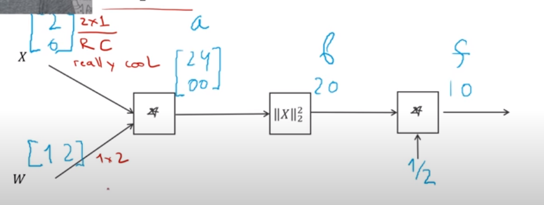
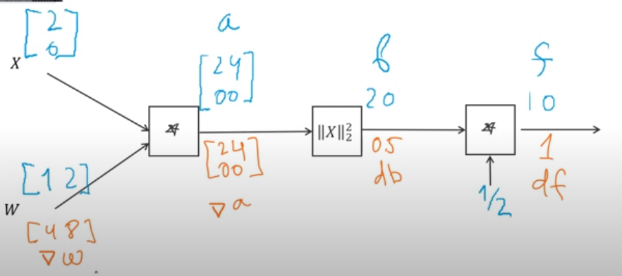
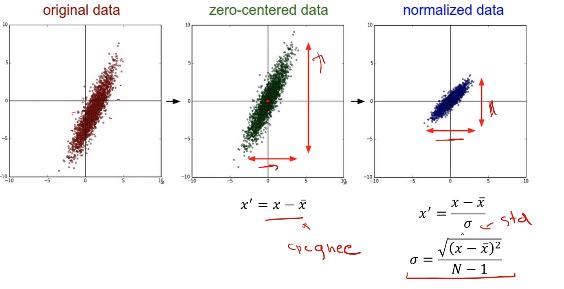
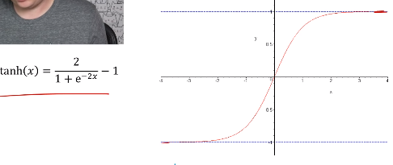
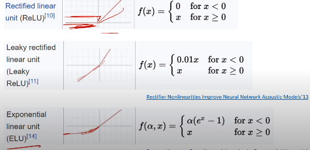
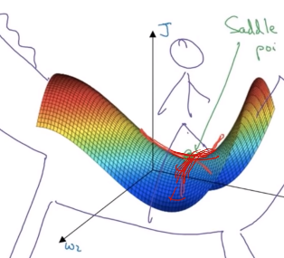

# Нейронные сети - подробности ([Слайды](https://www.dropbox.com/s/bdk2rdjxx4c0cte/Lecture%204%20-%20Framework%20%26%20Details%20-%20annotated.pdf?dl=0))

**Полносвязаные слои(Fully-connected layer)** - слои на вход которого приходят все значения из предыдущего слоя

## Backpropagation с матрицами






**Точно не надо транспанировать градиент!**

## Интерфейс слоя(Layer interface)


```python
class Layer:
  def forward(self, x):
    result = ... # промежуточные вычисления
    self.x = x # сохраняем значения которые нам понадабятся при обратном проходе
    return result

  def backward(self, grad):
    dx = ... # используем сохраненные значения чтобы вычслить градени по x и по w
    dw = ...
    self.w.grad += dW
    return dx
```

## Multi-class labeling

**sigmoid**

=\frac{1}{1%2Be^{-y_i}}>)

**binary cross entropy loss**

%2B(1-gt_c)*ln(1-p(c|x_s))}}}>)

**Самая простая функция ошибки(L1)**


## Что позволяют сделать библиотеки ML

1. Задать граф вычислений
2. Посчитать граденты на графе через backpropagation
3. Сделать это всё на GPU

## PyTorch делает людей счастливыми!

## PyTorch делает людей очень счастливыми!

## Подготовка данных



Нормализацию обычно не делают для картинок

## Выбор активационной функции



Проблема: Vanishing gradients

При выходи из эффективного пространства функции она сразу уводит значение функции в -1 или 1 и любой градиент она превратит в 0 и убивает возможность тренироваться всей предыдущей системе

Из за этого сейчас используется Rectifier Linear unit(ReLU), она правда тоже убивает градиент при x <0, но это необходимо для нелинейности

Чтобы этого избежать иногда используется Leaky ReLU и ELU



## Инициализация весов

### Самый простой вариант

>)

**Как выбрать a?**

Если a слишком большая результат будет получаться безумно большим

Если а слишком маленька результат будет затухать, как и градиенты

### Xavier initialization

```python
a = 1 / sqrt(in_num)
W = a * randon(in_num, out_num)
```

torch.nn.init.xavier*normal*

### Kaiming

```python
a = 1 / sqrt(in_num / 2)
W = a * randon(in_num, out_num)
```

torch.nn.init.kaiming*normal*

## Обновление параметров

### SGD

```
w = w - learning_rate * gradient
```

### Momentum

```
velocity = momentum * velocity - learning_rate * gradient
w = w _ velocity
```

momentum - коэффицент, как правило 0.9-0.99
В PyTorch torch.optim.SGD

**Седловая точка** - точка в которой градиент равено нулю, но она не является даже локальным минимумом по всем направлениям



## Adagrad

```
accumulated = gradient ** 2
adaptive_learning_rate = learning_rate / sqrt(accumulated)
w = w - adaptive_learning_rate * gradient
```

torch.optim.Adagrad

## RMSProp

```
accumulated = rho * accumulated * (1-rho) * gradient ** 2
adptive_learning_rate = learning_rate / sqrt(accumulated)

w = w - adaptive_learning_rate * gradient
```

torch.optim.RMSprop

### Adam(RMSProp + Momentum) - хороший начальный выбор

```
velocity = beta1 * velocity + (1-beta1) * gradient
accumulated = beta2 * accumulated + (1 - beta2) * gradient ** 2

adaptive_learning_rate = learning_rate / sqrt(accumulated)

w = w - adaptive_learning_rate * velocity
```

torch.optiom.Adam
