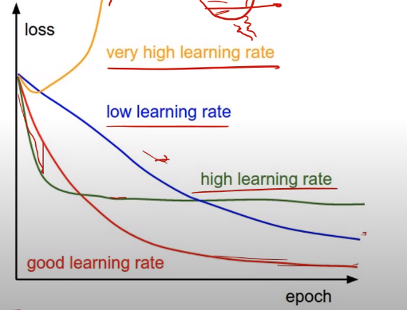

# Нейросети на пркатике([Слайды](https://www.dropbox.com/s/fa047fxlbqcmv96/Lecture%205%20-%20Neural%20Network%20In%20Practice%20-%20annotated.pdf?dl=0))

GPU > CPU для паралельных вычислений(и как следствие для нейросетей)

## Как программировать на GPU

На особом диалекте C

Нас так мучать не будут

## Тренеровка моделей на практике

Главное - процесс тренеровки

Если Loss для val и train вместе медленно уменьшаются вместе скорее всего это underfitting

### Скорость обучения



**Annealing**

- Каждые X эпох уменьшать на 

* Уменажать на  на плато

**Плато** - плато занчение ошибки на val

```python
torch.optim.lr_scheduler
```

Если ошибка на train падает, а на val растёт то это overfitting

### Решуляризация

- **L2**
- **Dropout** - во время тренеровки каждый раз из сети убирается половина нейронов(уже не модно)

**Есть методы которые помогают и при underfit и при overfit!**

## Batch Normalization

Слой между весами и активацией преобразует веса так чтобы у них было предсказуемое среднее и масштаб

}=\frac{x^{(k)}-E[x^{(k)}]}{\sqrt{Var[x^{(k)}]}}>)

Считает среднее всех выходово, вычитает из каждого это среднее и делит их на корень из вэрианс

}=\gamma^{(k)}\hat{x}^{(k)}+\beta^{(k)}>)

Масштаб и смещение тоже учатся

- Ускоряет и стабилизирует тренеровку
- Регуляризирует
- Не так важна инициализация

Как же оно работает при предсказании с одним примером?
Накапливать значение среднего и дисперсии в процессе тренеровки

Ставить до или после функции активации - хороший вопрос, надо пробовать

## Поиск гиперпараметров
* Начальный learning rate
* Коэфф. annealing
* Коэфф. L2 регуляризации
* Размер батча
* ...

Часто имеет смысл не пробовать все комбинации параметров, а выбирать их случайно в заданном диапазоне

Надо сначала искать на больших расстояниях и потом уменьшать его вокруг хороших результатов

## Начинать с:
* Вычитаем среднее из данных
* Оптимизатор - Фвфь
* Batch Normalization - добро
* Learning rate annealing на плато
* Перебераем гиперпараметы(важнее всего learning rate)
* **Смотри на графики тренеровки**

## Ансабль моделей
Натренеровать несколько моделей и усреднить их результат

Откуда брать разные модели:
* Пробовать разные модели и подходы
* Cross-validation folds
* Креатив!?

# Back to the present
**LR Range test + Cyclical Learning Rate**

LR Range test - начать тренировать модель с маленьким learning rate, по ходу тренеровки будем его увеличивать до какого-то большого значения и смотрим в каком месте accuracy перестаёт растил

Cyclical Learning rate - мы будем линейно ходить от минимального до максимального learning rate

Cosine learning rate - уменьшать learinging rate по косинусу, можно объеденить с идеей Cyclical

## Инженерный подход к перебору гиперпараметров
Нипонятно

# Production
**Production** - это использование натренерованных моделей для предсказания

## Deployment
- Интегрируется не только с Python
- Высокие требования по стабильности и надёжности
- Инструементы для запуска модели на сервере
- Оптимизированно под железо, где запускается модель

ONNX - стандарт модели для переноса между фреймворками