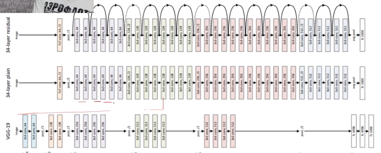

# CNN - Convolutional Neural Networks([Слайды](https://www.dropbox.com/s/k8rtpvlc3xaj65b/Lecture%206%20-%20CNNs%20-%20annotated.pdf?dl=0))

В чём проблема полносвязанных слоёв:

- Очень много весов
- Малейшие изменения изображения, вроде сдвига требуют обучения

Кошечки помогли нам придумать вариант получше. Оказалось что у них есть нейроны чуствительные только к определённым ориентациям палочки.

## Свёрточный слой(Convolution layer)

Значение нейронов завистят от ограниченной облости вокруг него.

То есть веса повторна используются для разных нейронов.

Колличество каналов - колличество паттернов которые мы хотим найти

Можно распрямить матрицы чтобы их потом было удобнее умножать...

**Как работают нелинейности?**

Они работают как обычно :)

**Дополнение и шаг(Padding and stride)**

Padding - дополнить вход с краю каким-то числом(обычно 0) чтобы можно было сделать размер выхода размеру входа

Stride - это на сколько пикселей мы делаем шаг когда идём от одного output к следкющему

Их можно комбинировать

## Pooling layer

Даёт возможность менять разрешение

Он берёт и сжимает участки x\*x в 1/1

Делает это по какому-то простому првилоу, например max

## Свёрточная нейронная сеть

Делаем некоторе колличество Convolution и Pooling слоёв, в конце выпрямяем последний слой и скармливаем softmax

Такая архитектура сама по себе хорошо оптимизирована под сдвиги изображения

**Как знать какие пиксели картинки могут повлиять на нейрон?**
Идём назад и считаемv

[Продолжить просмотр](https://youtu.be/tOgBz8lFz8Q?t=2986)

## Архитектуры

### LeNet`98

Распозновала индексы на почтовых конвертах

### AlexNet`12

Эта и все остальные училиьсь на IMAGENET

### VGG

Состоит из одинаковых блоков

### ResNet`15

Было обноружено что многослойные сети плохо тренеруются

Из этого вышла идея Residual net, в них слои не полностю меняют данные, а лишь вносят исправления на их основе

Это позволяет тренировать на ОЧЕНЬ глубокие сети

## Как правильно готовить картинки, особенно для свёрточных сетей

Если нам надо тренероваться на картиках с другим соотношением сторон или разрешением: просто скейлим её забивая на всё :)

**Transfer learing**: Допустим, что у нас малло данных(10-100), но мы всё равно хотим натренировать сеть.

Тогда мы можем взять сеть натренерованную на другой задаче, заморожу в ней все слои кроме последнего и буду обучать его.

А если данных у меня не очень мало(1000+) замораживаются первые слои, а следющие обучаются с разной скоростью, возростающей к выходу

## Как генерировать больше данных

**Аугментации!**

- Отражение
- Смещение
- Цветокоррекция
- Повороты
- Наклоны
- И другой креатив

[Хороший список](https://github.com/albu/albumentations)

**Online augmentation** - размножаем датасет не приминив все аугументации в начале, а применяя случайные в процесее тренеровки

**Test time augmentation(TTA)** - создадим батч состоящий из одной картинки к которой применены различные аугментации, предскажем для него, усредним и получим скорее всего более хороший результат

# Формулы

**Для Conv Layer**

O = Size (width) of output image.

I = Size (width) of input image.

K = Size (width) of kernels used in the Conv Layer.

N = Number of kernels.

S = Stride of the convolution operation.

P = Padding.

The size (O) of the output image is given by

The number of channels in the output image is equal to the number of kernels N.

**Для Pool Layer**

O = Size (width) of output image.

I = Size (width) of input image.

S = Stride of the convolution operation.

P_s = Pool size.

The size (O) of the output image is given by

