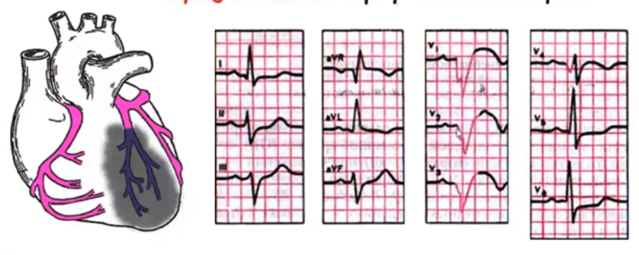

# ЭКГ при различных локализациях инфаркта миокарда

Сердце в поперечном разрезе:

Иногда для постановки диагноза необходимы дополнительные электроды

**Субэндокардиальная ишемия передней стенки левого желудочка**

**Субэпикардиальная ишемия переднебоковой стенки левого желудочка**

**Ишемия задней стенки левого желудочка**

**Субэпикардиальное повреждение передней стенки левого желудочка**

**Субэндокардиальное повреждение передней стенки левого желудочка**

**Повреждение задней стенки левого желудочка**

## Типичные признаки инфаркта миокарда

1. Патологический зубец Q или компелкс QS
2. Уменьшение амплитуды зубца R
3. Подъём сегмента ST
4. Отрицательный "коронарный" зубец T

Определение зоны инфаркта(в зависимости от того где зарегестрированны указанные выше изменения):
1. В отведениях V1-V3 - переднеперегородочный ИМ
2. В отведения V3-V4 - передневерхушечный ИМ
3. В отведения I, aVL, V5 и V6 - переднебоковой ИМ
4. В отведениях I, aVL, V1-V6 - распространённый передний ИМ
5. В отведениях III, aVF, II - заднедифрагмальный (нижний) ИМ
6. В отведениях V5, V6, III, aVF, II - заднебоковой ИМ

**ЭКГ при переднеперегородочном и верхушечном инфаркте миокарда**

**ЭКГ при переднебоковом инфаркте миокарда**

**ЭКГ при заднедиафрагмальном инфаркте миокарда**

