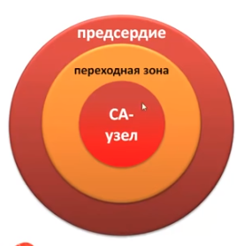

# Блокады
Могут замедлять или не пропускать импульс

## Синотариальные блокады

1. Проблемы в СА-узле (нет импулься или импульс недостаточной силы)
2. Не проводится импульс от СА узла к предсердию
3. Предсердия не воспринимают импульс

### СА блокада I степени
*Замедление проведения импульса*

Никак не видна на ЭКГ

Для выявления необходимо провести запись потенцеала на СА узле или электрическую стимуляцию предсердий

### СА блокада II степени
*не все импульсы доходят до предсердий*

**тип 2**

Выпадает 1 или несколько зубцов R, комплекс QRS, зубец T

**тип 1(с периодикой Самойлова-Венкебаха)**

Перед выпадением видно прогрессивное снижение интервала R-R(или P-P)

Следющий после выпадения R-R интервал больше предшествовавшего выпадению

R-R интервал вокруг выпавшего комплекса <2R-R предшествоваших ему

### СА блокады III степени
*ни один импульс из узла СА узла не доходит на сердца или они даже не возникают*

Жизнеугрожающая ситуация

## Внутрепредсердная блокада

Проведение импульса по предсердиям замедленно, на кардиограмме видо по удлинению зубца P(>0.1c) и только этому

## AB блокды
Удлинение сегмента P-Q(>0.2c)

**AB блокада II степени**

**АВ блокада III степени(полная АВ-блокады)**
Предсердие и желудочки сокращаются в отдельных ритмах

На каридиограмме не будет связи между зубцом P и QRS

