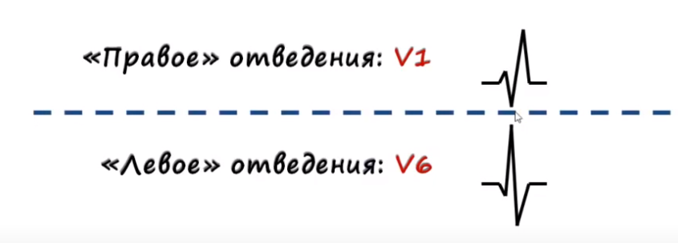

# Блокады (2-я часть)

Отведения можно разделить на "Правые" и "Левые" отведения:

"Правые" отведения: III, aVF, V1, V2

"Левые" отведения: I, aVl, V5, V6

## Блокада правой ножки Пучка Гиса

Комплексы на Правом и Левом отведении почти зеркальны

При блокаде правой ножки Пучка Гиса комплексы могут выглядеть так:

**Критерии блокады ПНПГ**

|Полная блокада ПНПГ:|НЕ Полная блокада ПНПГ:|
|---|---|
|rsR', rSR', RsR', RSR', rR', RR', в V1, V2, (III, aVF)| аналогично полной |
| QRS>0.12с  | QRS=0.10-0.12c  |
| Депрессия ST в V1, V2, (III, aVF), Подъём ST в V5, V6, (I, aVL)  | чаще нет  |
| Отрицательный T в V1, V2, (III, aVF)  | чаще +  |

## Блокада левой ножки Пучка Гиса

Зеркальная ситуация относительно блокады правой ножки

|Полная блокада ЛНПГ:|НЕ Полная блокада ЛНПГ:|
|---|---|
| rR', RR', Rr', R в V5, V6| аналогично полной |
| QRS>0.12с  | QRS=0.10-0.12c  |
| Депрессия ST в V5, V6, Подъём S1 в V2  | +/- |
| Отрицательный T в V5, V6 | +/-  |
| Электирческая ось сердца(реже отклонена в лево) | Нормальная  |

## Блокады ветвей Левой Ножки Пучка Гисса

Критерии блокады ветвей ЛНПГ

| Блокада передней ветви | Блокада задней ветви|
|---|---|
| QRS не раширен/расширен на 0.01-0.02c| аналогично передней |
| ЭОС резко влево(a<=-60) | ЭОС резко вправо (a>=+120)  |
| S > R(II, III, aVF)  | S > R(I, aVL) |

