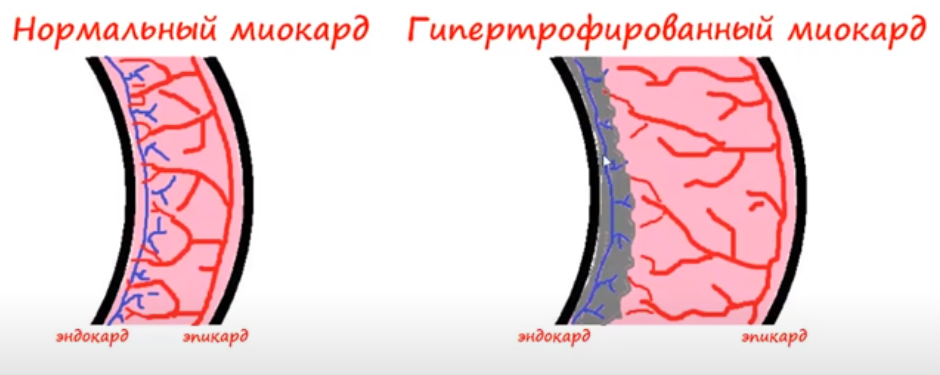
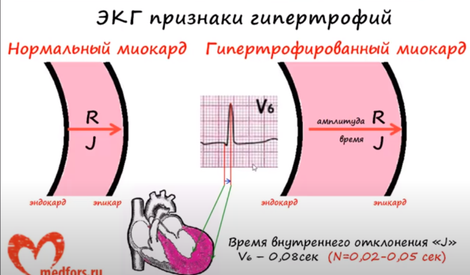
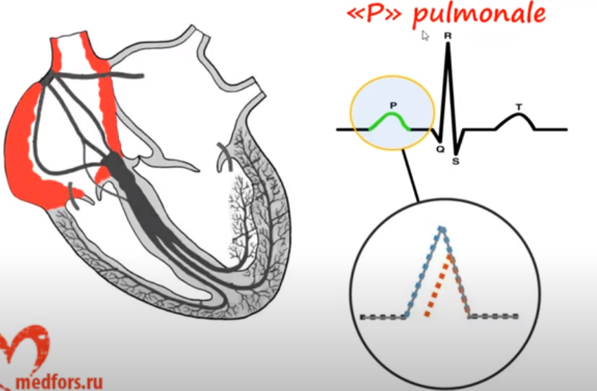
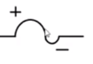
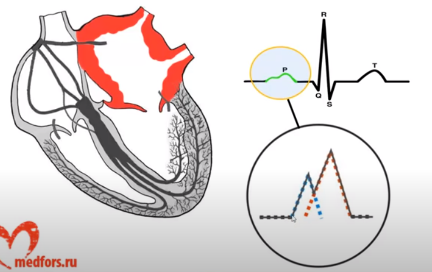
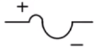
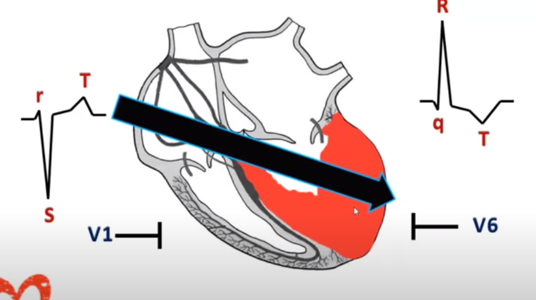
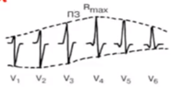
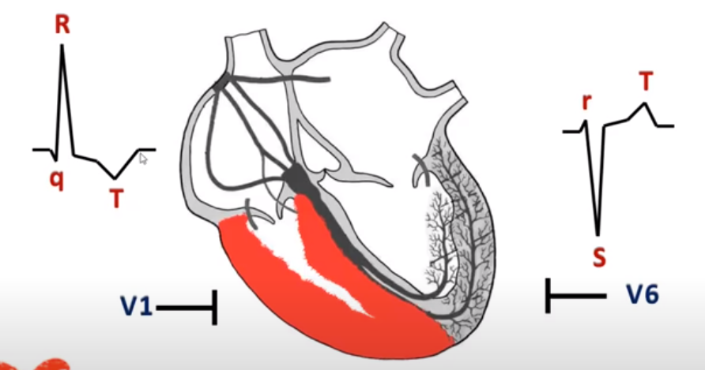

# ЭКГ при гипертофиях различный отделов сердца

Признаки гипертрофий

ЭКГ признаки гипертрофий:

1. Увеличение времени внутреннего отклонения "J"
2. Увеличение ампилтуды зубца R
3. Ишемия субэндокардиальных слоёв миокарда
4. Нарушение проводиости в гипертрофированном миокарде
5. Отклонение ЭОС в сторону гипертрофированного желудочка

## Гипертрофия правого предсердия

ЭКГ признаки гипертрофии правого предсердия

1. Высокоий остроконечный зубец P - самы важный и главный признак!
   * Высота зубца P больше 2-2.5 мм
   * ширина зубца P не увеличена, реже увеличина до 0.11-0.12 сек
   * как првило, вершина патологического зубца P симметрична
   * регестрируется в II, III, aVF 
2. Электрическая ось зубца P зачастую отклоняется вправо: PIII>PII>PI (в норме PII>PI>PIII)
3. В V1, V2 зубец P высокий заострённый или двухфазный с резким преобладанием первоположительной фазы
4. Чем больше гипертрофия ПП, тем в большем колличестве грудных отведений отмечается выскокий заострённый зубец P

## Гипертрофия левого предсердия

ЭКГ признаки гипертрофии левого предсердия:

1. Двугорбый широкий зубец P, в котором вторая вершина зубца превышает по амплитуде первую
   * Ширина зубца P превышает 0.1-0.12 сек
   * высота зубца P увеличена незначимельно
   * Широкий двугорбый зубкй P обычно резестрируется в отведениях: I, II, aVL, V5, V6
2. Зубец P в V1 отрицательный или двуфазный с резким преобладанием второй отрицательной фазы, ширина которой увеличена - очень характеный признак
3. Электрическая ось зубца P зачастую отклоняется влево (PI>PII>PIII)

## Гипертрофия левого желудочка

ЭКГ признаки гипертрофии левого желудочка

1. Высокие зубцы RV5, RV6 > 16 mm (RV6>RV5>RV4 - чёткий признак!) 
2. Глубокие зубцы SV1, SV2 > 12 mm
3. RV5(V6) + SV1 > 28 mm
4. Зубец TV5, TV6 отрицательный
5. Сегмент STV5 ниже изолинии, а STV1, STV2 выше изолинии
6. Отклонение ЭОС влево

## Гпертрофия правого желудочка

ЭКГ признаки гипертрофии правого желудочка

1. Наличие высого зубца RV1, V2 > 7 mm
2. Появление глубокого зубца SV5, V6 > 7 mm
3. RV1 + SV5(V6) > 11 mm
4. Зубец TV1 отрицательный
5. Сегмент STV1 ниже изолинии, а STV5, STV6 выше изолинии
6. Отклонение ЭОС вправо