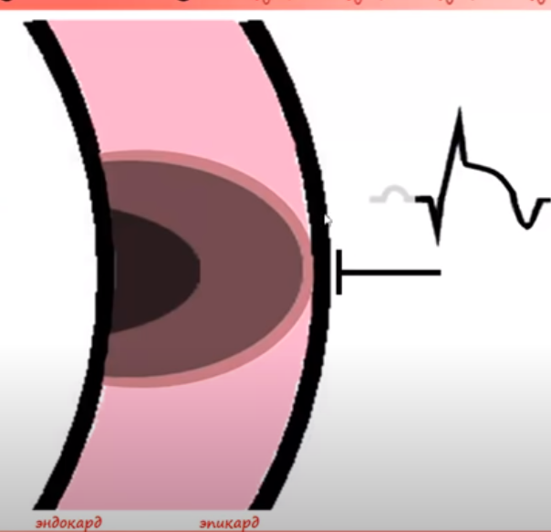

# Изменения ЭКГ при инфарктах

Все изменения при инфарктах не являются строго специфическими и могут наблюдаться и при других заболеваниях.

Нельзя диагностировать инфаркты только по ЭКГ.

Инфаркт - омертвление участка миокарда в результате недостаточного кроваснабжения.

Норма:

Субэндокардиальная ишемия:

Субэпикардиаьная ишемия:

Трансмуральная ишемия:

Субэндокардиальное повреждение:

Субэндокардиальное повреждение + Субэпикардиальная ишемия:

Субэпикардиальное повреждение:

Субэпикардиальное повреждение + Субэпикардиальная ишемия:

Трансмуральное повреждение:

Трансмуральный инфаркт:

НЕтрансмуральный инфаркт:

НЕтрансмуральний инфаркт + Субэпикардиальная ишемия:

Интрамуральный Инфаркт(неQ): нет зубца Q на ЭКГ

Субэндокардиальный инфаркт (не Q) + Субэндокардиальное повреждение:

Общая картина:

## Классификация

Инфаркты:
* ST
  * С подъёмом ST
  * Без подъёма ST
*  Q
    * Q
    * НеQ

Стадии развития инфаркта:
* Повреждения (острейшая) - до 3-х суток
* Острая - до 3-х недель
* Подострая - до 3-х месяцев
* Рубцевания - остаток жизни

**Стадия повреждения (острейшая)**:

Уже через несколько часов начинает формироваться зона некроза

**Острая стадия**

Острая стадия характеризуется уменьшением зоны повреждения, так как возникает зона ишемии и увеличивается хона некроза

Острая стадия переходит в Подострую стадию

**Подострая стадия**

**Рубцовая стадия**

Инфаркт может быть и без изменений на ЭКГ!